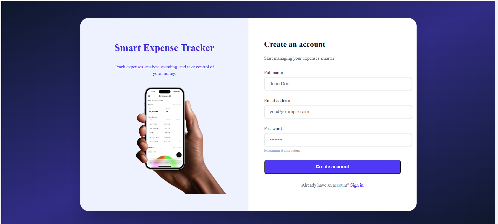
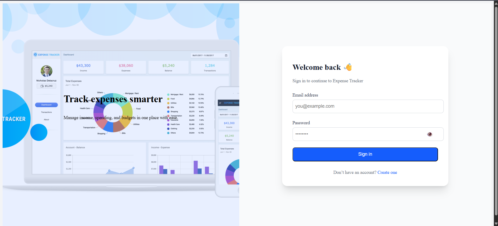
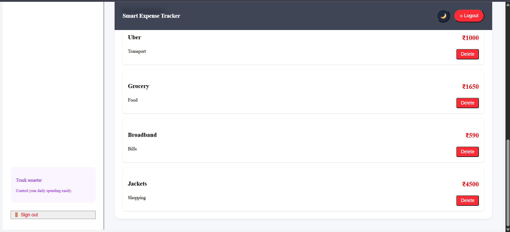
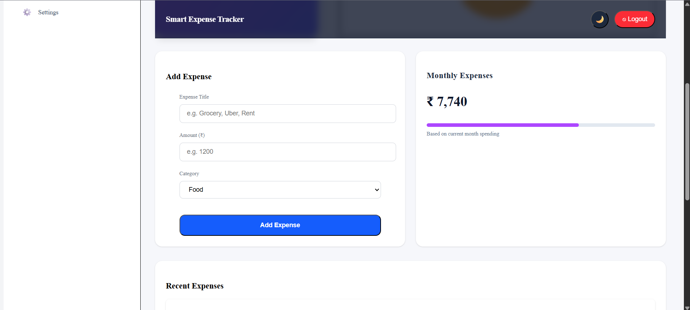

# 💸 Smart Expense Tracker

A full-stack **Expense Tracker** application that helps users track, analyze, and manage their daily expenses with a modern dashboard UI.

Built using **React, Tailwind CSS, Node.js, Express, MongoDB**, and **JWT authentication**.

---

## 🚀 Features

- 🔐 User Authentication (Register / Login with JWT)
- 📊 Interactive Dashboard
- 💰 Balance Card (Available Balance, Monthly Limit, Spent)
- 🧾 Add / Delete Expenses
- 🥧 Category-wise Expense Pie Chart
- 🧠 Protected Routes (Session handling)
- 📱 Fully Responsive UI

---

## 🖼️ Screenshots


### 🔐 Login Page


### 📝 Register Page


### 📊 Dashboard Overview



### ➕ Add Expense


---

## 🛠️ Tech Stack

### Frontend
- ⚛️ React (Vite)
- 🎨 Tailwind CSS
- 📊 Recharts
- 🔄 Axios
- 🔐 React Router DOM

### Backend
- 🟢 Node.js
- 🚀 Express.js
- 🍃 MongoDB + Mongoose
- 🔐 JWT Authentication
- 🔑 bcryptjs

---

## 📁 Project Structure

expense-tracker/
│
├── backend/
│ ├── controllers/
│ ├── models/
│ ├── routes/
│ ├── middlewares/
│ └── server.js
│
├── frontend/
│ ├── src/
│ │ ├── components/
│ │ ├── pages/
│ │ ├── api/
│ │ └── App.jsx
│ └── main.jsx
│
└── README.md


## ⚙️ Environment Variables

Create a `.env` file in the **backend** directory:

```env
PORT=5000
MONGO_URI=your_mongodb_connection_string
JWT_SECRET=your_jwt_secret 
```

## ⚙️ Environment Setup

▶️ Run Locally
1️⃣ Clone the Repository

git clone https://github.com/your-username/expense-tracker.git
cd SmartExpenseTracker

2️⃣ Backend Setup
cd backend
npm install jsonwebtoken bcryptjs express mongoose
npm run dev

3️⃣ Frontend Setup
cd frontend
npm install
npm run dev
npm install recharts
npm install -D tailwindcss @tailwindcss/postcss autoprefixed
npm install vite

Frontend: http://localhost:5173
Backend: http://localhost:5000
